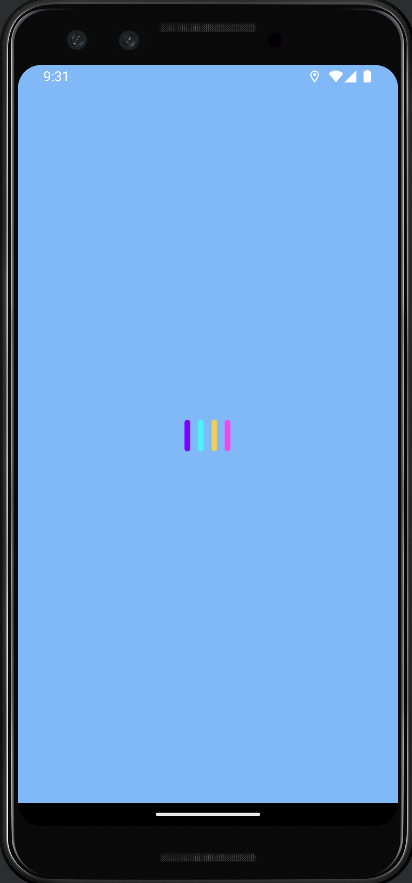
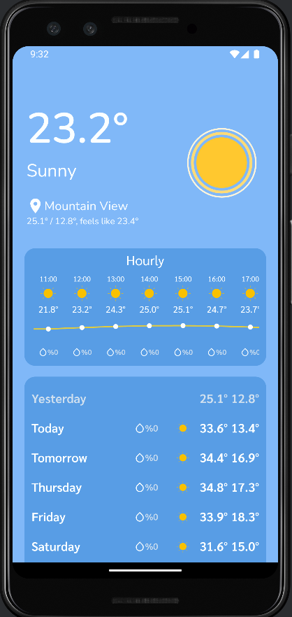
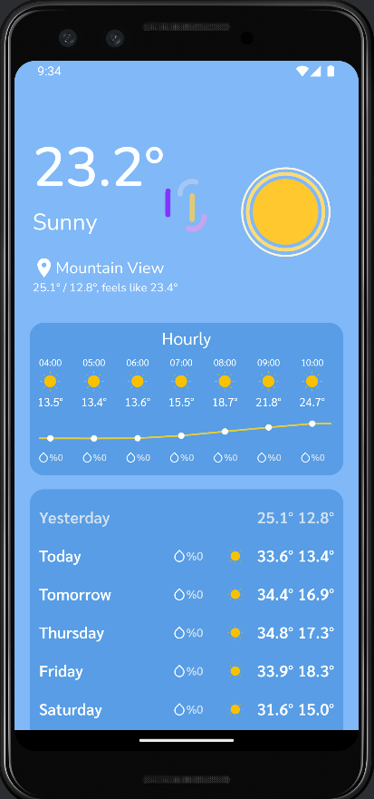
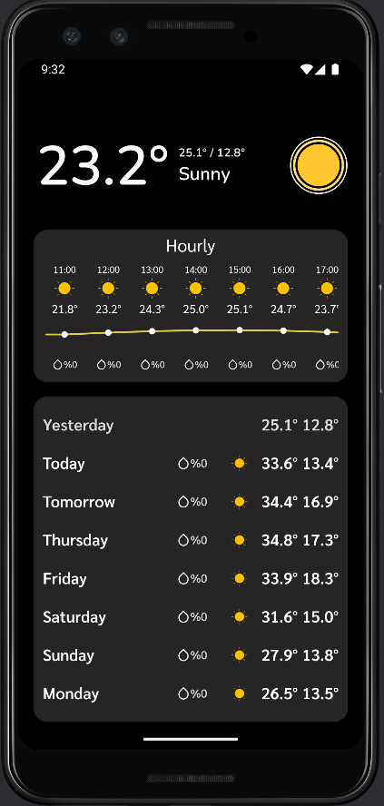
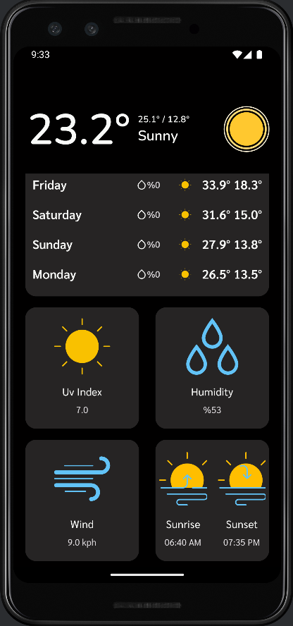
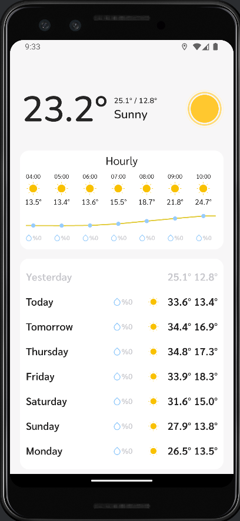
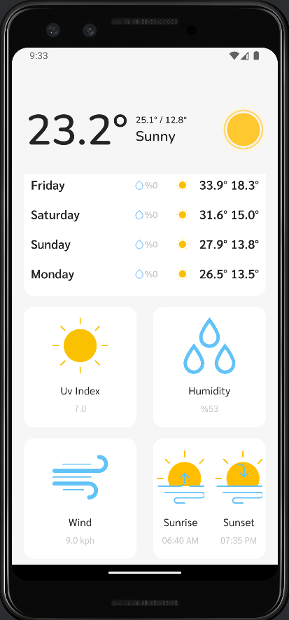

# Samsung Weather App Clone

This app is for getting forecast data from weatherapi.com. Also, this app is cloned from Samsung's weather app :)

## Features

- Responsive UI
- Live location detection
- Different animations for different weather conditions
- Storage for last weather data
- Pull to refresh for the latest data

## Tech Used

- MVVM architecture
- Navigation
- Retrofit
- Coroutines
- Flows
- Shared preferences
- Hilt
- Room
- Lottie

## Custom Views

- Pull to refresh
- Temperature Graph

## Screenshots

<table>
  <tr>
     <td>Loading Screen</td>
     <td>Main Screen</td>
     <td>Refresh Screen</td>
     <td>Dark Screen</td>
  </tr>
  <tr>
     <td width="25%"></td>
     <td width="25%"></td>
     <td width="25%"></td>
     <td width="25%"></td>
  </tr>
 </table>

<table>
  <tr>
     <td>Dark Screen</td>
     <td>Light Screen</td>
     <td>Light Screen</td>
  </tr>
  <tr>
     <td width="25%"></td>
     <td width="25%"></td>
     <td width="25%"></td>
  </tr>
 </table>

## Installation

To install the project:

1. Clone the repository:
    ```bash
    git clone https://github.com/Prometheum01/WeatherAppJetpack.git
    ```
2. Create a SecretConstants file in utils:
    ```bash
    object SecretConstants {
    const val API_KEY = "Your API KEY"
    const val BASE_URL = "https://api.weatherapi.com/v1/"
    }
    ```
3. Run the app:

## License

This project is licensed under the [MIT License](LICENSE).

## Contact

If you have any questions, feel free to contact me:

- Email: ce.enes.yilmaz@gmail.com
